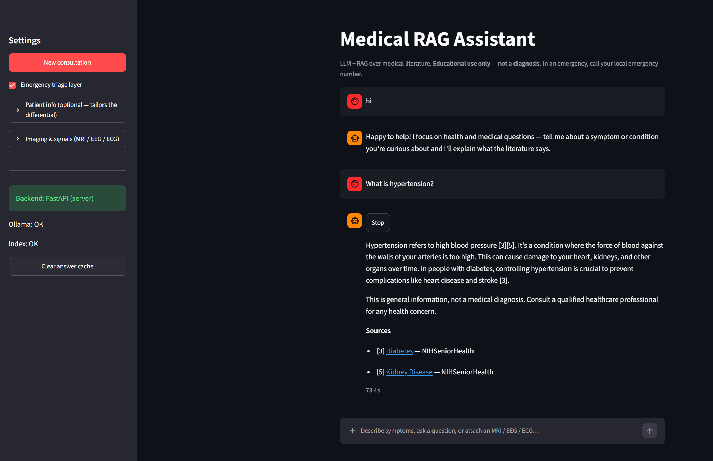
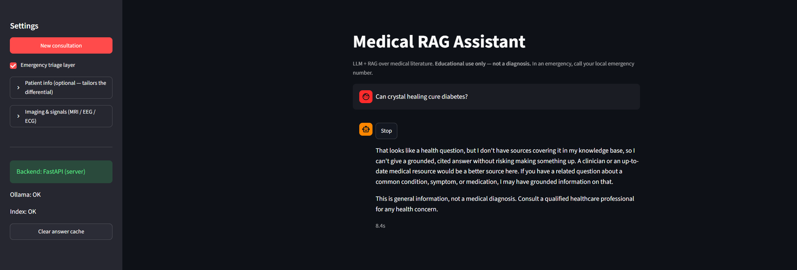
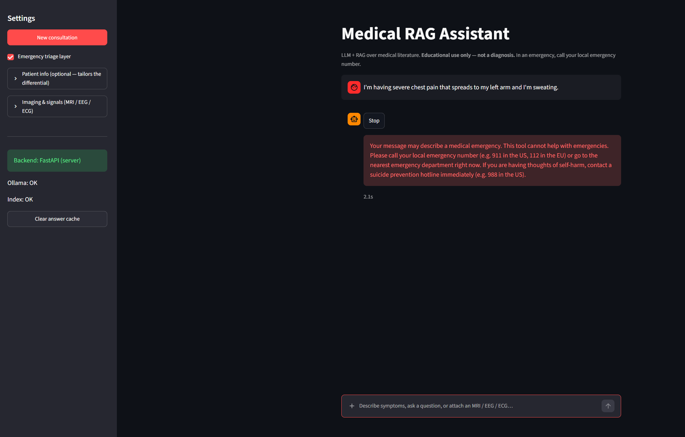
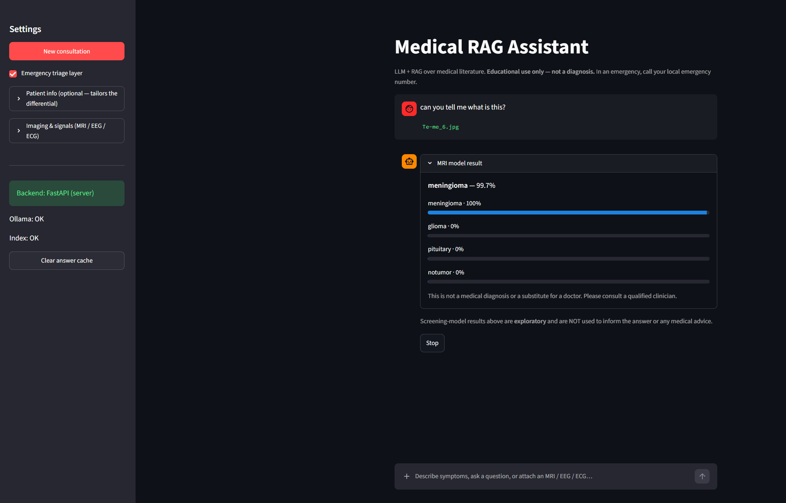
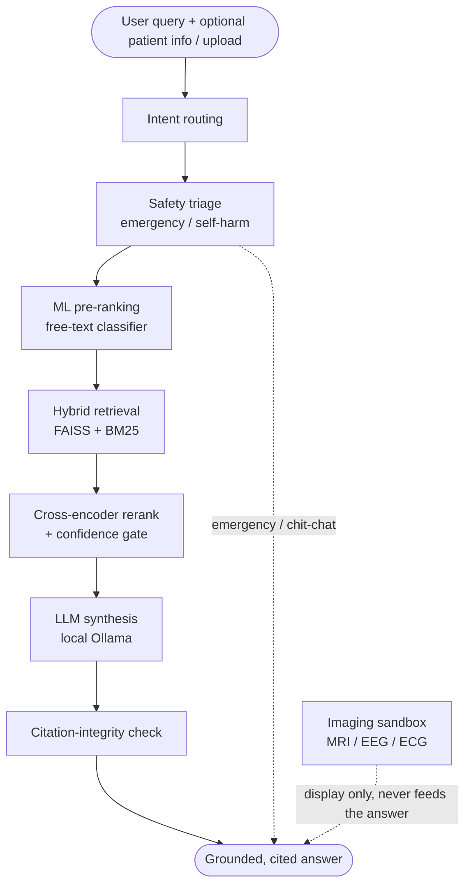

# Hybrid Medical Assistant

[](https://github.com/nhahub/NHA-4-236/actions/workflows/ci.yml)
[](LICENSE)


> A fully local, educational medical assistant combining **Machine Learning**,
> **Retrieval-Augmented Generation (RAG)**, and a **local LLM** to provide
> grounded, citation-backed medical information — never a diagnosis.

⚠️ **Educational use only. Not a medical device or diagnostic tool.** Always consult
a qualified healthcare professional; in an emergency, call your local emergency number.

A local LLM (via [Ollama](https://ollama.com)) answers **only** from retrieved
medical literature, cites every claim, and declines when the corpus can't support
an answer. A free-text ML classifier pre-ranks likely conditions, and a
code-enforced safety layer catches emergencies before any model runs. No paid APIs;
no data leaves your machine.

---

## Table of Contents

- [Highlights](#highlights)
- [Architecture](#architecture)
- [Quick Start](#quick-start)
- [Features](#features)
- [Tech Stack](#tech-stack)
- [Project Structure](#project-structure)
- [API](#api)
- [Evaluation](#evaluation)
- [Safety](#safety)
- [Documentation](#documentation)
- [Roadmap](#roadmap)
- [License](#license)

---

## Screenshots

<!-- Save the four screenshots into docs/img/ with these exact names:
     grounded-answer.png · honest-decline.png · emergency-triage.png · mri-sandbox.png -->

| Grounded answer with citations | Honest decline (out of corpus) |
|:---:|:---:|
|  |  |
| **Code-enforced emergency triage** | **Imaging sandbox (MRI screening)** |
|  |  |

---

## Highlights

- 🧠 **Hybrid AI** — ML + RAG + a local LLM, each covering the others' weaknesses.
- 📚 **Grounded answers** — every claim is backed by retrieved literature and cited.
- 🛡️ **Safety-first** — rule-based emergency triage runs before any LLM call.
- 💻 **Fully local** — no paid APIs; data stays on your machine.
- 🔬 **Imaging sandbox** — optional MRI / EEG / ECG screeners, isolated from the answer.
- 📈 **Evaluated** — reproducible benchmarks and 200+ offline tests.

---

## Architecture



The **ML** layer narrows the space, **RAG** supplies citable facts, and the **LLM**
writes a grounded, hedged answer — with triage, the confidence gate, and the
citation-integrity pass all enforced in code, not left to the model. Full
walkthrough and diagrams: **[docs/DOCUMENTATION.md](docs/DOCUMENTATION.md)**.

---

## Quick Start

**Prerequisites:** Python 3.10+, [Ollama](https://ollama.com) installed and running,
~16 GB RAM recommended for an 8B model (CPU works; GPU is faster).

```bash
# 1. Install
python -m venv .venv && source .venv/bin/activate   # Windows: .venv\Scripts\activate
pip install -r requirements/base.txt
cp MedicalHybirdModel.env.example MedicalHybirdModel.env

# 2. Pull a local model
ollama pull llama3.1:8b        # lighter: ollama pull mistral:7b-instruct-q4

# 3. Build the knowledge base + train the classifier (idempotent)
python -m scripts.setup --with-ml

# 4. Run
python -m uvicorn api.main:app --reload             # API → http://localhost:8000/docs
python -m streamlit run dashboard/streamlit_app.py  # UI  → http://localhost:8501
```

> **Docker:** `docker compose up api dashboard` (build the index once first). See the
> [deployment guide](docs/DOCUMENTATION.md#11-deployment).

---

## Features

- **ML pre-ranking** — a free-text symptom classifier (S-PubMedBert + logistic
  regression, 22 conditions) that **abstains** when unsure and is cross-checked
  against retrieved passages.
- **Hybrid retrieval** — dense (FAISS) + sparse (BM25) fused with Reciprocal Rank
  Fusion, then a cross-encoder rerank and de-duplication.
- **Confidence gate** — off-topic / out-of-corpus queries are declined, not faked.
- **Citation integrity** — any `[n]` marker not backed by a real passage is stripped.
- **Safety layer** — age/pregnancy-aware emergency & self-harm triage before any
  LLM call; the non-diagnostic disclaimer is appended in code.
- **Streaming + Stop** — token-by-token SSE with a working Stop button.
- **Multi-turn & patient profile** — an optional durable profile tailors the
  differential and feeds triage.
- **Imaging sandbox** — MRI / EEG / ECG screeners that display a result but **never**
  influence the grounded answer.

Details for each: **[docs/DOCUMENTATION.md](docs/DOCUMENTATION.md#4-module-reference)**.

---

## Tech Stack

| Layer | Technology |
|-------|-----------|
| LLM runtime | [Ollama](https://ollama.com) (local; `llama3.1:8b` default) |
| Retrieval | [FAISS](https://github.com/facebookresearch/faiss) (dense) + BM25 (sparse) + Reciprocal Rank Fusion |
| Embeddings / rerank | `sentence-transformers` — S-PubMedBert bi-encoder + MiniLM cross-encoder |
| ML classifier | scikit-learn logistic regression on shared embeddings |
| Imaging models | PyTorch (EfficientNet-B0, 1-D CNN, 1-D ResNet) |
| Backend / UI | FastAPI (SSE streaming) + Streamlit |
| Tooling | Docker, pytest, ruff |
| Knowledge base | [MedQuAD](https://github.com/abachaa/MedQuAD) + NIH sources |

---

## Project Structure

```
.
├── assistant.py        # Orchestrator (the pipeline)
├── api/                # FastAPI backend + SSE streaming
├── rag/                # Hybrid retrieval (FAISS + BM25 + rerank)
├── ml_model/           # Free-text symptom classifier
├── llm/                # Ollama client + prompt templates
├── safety/             # Intent routing + red-flag triage
├── dashboard/          # Streamlit chat UI
├── models/             # MRI / EEG / ECG imaging sandbox
├── eval/               # Evaluation harness + cases
└── tests/              # 200+ offline tests
```

Full module-by-module explanation: **[docs/DOCUMENTATION.md](docs/DOCUMENTATION.md#4-module-reference)**.

---

## API

| Endpoint | Method | Purpose |
|----------|--------|---------|
| `/ask` (+ `/ask/stream`) | POST | Grounded answer to a question (blocking or SSE) |
| `/symptom-check` (+ `/stream`) | POST | Ranked differential (+ optional patient info, ML pre-ranking) |
| `/analyze/{mri,eeg,ecg}` | POST | Imaging/signal sandbox (multipart upload) |
| `/health` | GET | Ollama + index + ML model status |

```bash
curl -X POST http://localhost:8000/ask \
  -H "Content-Type: application/json" \
  -d '{"query": "What is influenza and how does it spread?"}'
```

Request/response schemas, SSE event format, and status codes:
**[docs/DOCUMENTATION.md](docs/DOCUMENTATION.md#49-api)** (or the live docs at `/docs`).

---

## Evaluation

All reported metrics are generated by the project's evaluation harness
(`python -m eval`) and are fully reproducible (CPU, `qwen3:1.7b` generator,
`llama3.1:8b` judge):

| What | Metric | Command |
|------|--------|---------|
| Retrieval | recall@5 **0.97**, MRR **0.90** (30 cases) | `eval.retrieval` |
| Symptom ML (free-text) | top-1 **0.915**, top-3 **1.00** (held-out) | `eval.symptom_ml` |
| Grounding / faithfulness | **0.85** (LLM-as-judge) | `eval.groundedness` |
| Emergency triage | sensitivity **1.00**, specificity **1.00** | `eval.triage` |
| Prompt-injection resistance | **8/8 (100%)** | `eval.injection` |
| Latency (QA, CPU) | retrieval ~1.2 s, end-to-end p50 **39 s** | `eval.latency` |

Methodology and model-choice benchmark:
**[docs/DOCUMENTATION.md](docs/DOCUMENTATION.md#9-evaluation-methodology)**.

---

## Safety

- **Not a diagnosis.** All output is non-diagnostic educational information.
- **Guardrails are code-enforced** — triage, intent routing, the confidence gate,
  and the disclaimer hold regardless of what the model does.
- **Bounded by the corpus** — coverage gaps become honest declines, not fabricated
  answers.
- **Imaging models are experimental** screeners, deliberately isolated from answers.

Full limitations: **[docs/DOCUMENTATION.md](docs/DOCUMENTATION.md#13-limitations)**.

---

## Documentation

| Document | What it covers |
|----------|----------------|
| **[docs/DOCUMENTATION.md](docs/DOCUMENTATION.md)** | The developer guide — every component, data flow, RAG, ML, safety, evaluation, configuration, deployment, design decisions. |
| **[docs/PROJECT_GUIDE.md](docs/PROJECT_GUIDE.md)** | A narrative, teach-me-everything walkthrough. |
| **[docs/CONTRIBUTING.md](docs/CONTRIBUTING.md)** | Dev setup, tests, and how to contribute. |
| **[docs/GIT.md](docs/GIT.md)** | What's tracked vs. regenerated; branching and commit conventions. |
| **[docs/SECURITY.md](docs/SECURITY.md)** | Reporting security / privacy issues. |
| **[models/README.md](models/README.md)** | The imaging/signal model package. |

---

## Roadmap

- A short demo GIF in this README.
- Broader everyday-primary-care corpus coverage.
- EEG model retrain with a patient-level split; confirmed ECG label map.

---

## License

Released under the [MIT License](LICENSE) (code only — the third-party datasets and
model weights have their own terms). This project is for **educational use only**
and is not a medical device. Contributions: **[docs/CONTRIBUTING.md](docs/CONTRIBUTING.md)**.
